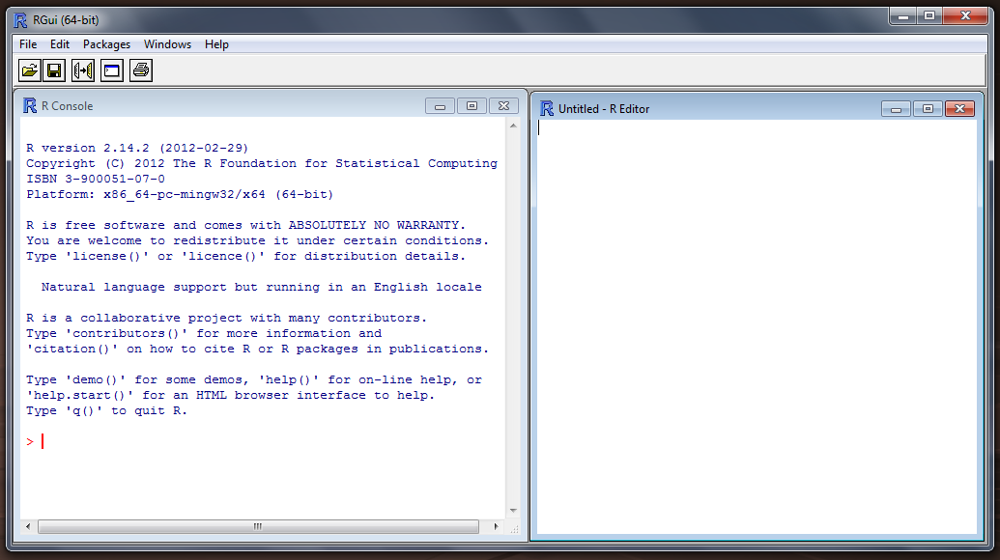
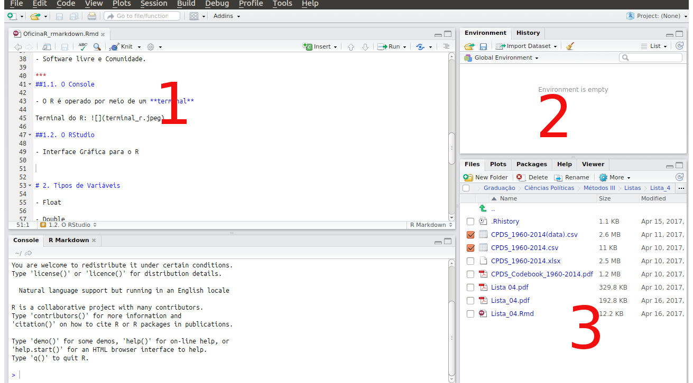

# Introdução

## Objetivos

Nosso objetivo é apresentar a linguagem de programação R para estudantes da graduação em Ciências Sociais da Universidade de São Paulo.

Acreditamos que ao ter um primeiro contato com a programação, o estudante poderá se sentir mais confiante em buscar novos conhecimentos dentro desta ou de outras linguagens.

# O que iremos aprender?

Não trabalharemos aqui com análise de dados ou programação avançada. Iremos englobar assuntos básicos entre eles: [Temos que pensar o tempo da oficina]

- Ambiente do R; 

- Tipos de variáveis;

- Estrutura dos dados;

- Controladores de Fluxos;

- Funções.

# 1. Ambiente do R - ESTA PARTE EU VOU COLOCAR NO SLIDE INICIAL, É MELHOR PARA APRESENTAR A FERRAMENTA

R é uma linguagem de programação. Logo nós a utilizamos por meio de linhas de código. Ainda que isso, a princípio, pareça ser muito complicado; com o tempo, você se sentirá confortável em programar linhas e mais linhas.

Uma das grandes vantagens do R é que ele é livre em todos os sentidos. Você pode baixá-lo sem pagar um centavo, ao mesmo tempo que, caso queira, pode ter acesso a toda a sua programação.

Ao contrário de outros programas, ele não tem uma empresa por traz. Não temos a IBM nos dando suporte como no SPSS. Basicamente, quando baixamos o R, temos acesso meramente aos pacotes básicos. Caso você queira um função que não exista, o único jeito é correr atraz de pacote pronto ou programar você mesmo.

Mas calma! De maneira geral, você não precisa passar dias programando cada uma das suas funções. Além daquelas que já vem no pacote básico (diga-se de passagem, já são mais do que suficientes para realizar diversos tipos de análise e tratamentos de dados), nós temos milhares de pacotes disponíveis totalmente de graça. Após ter uma noção básico do R, você provavelmente começará a utilizá-los.

Contudo, antes disso, vamos nos familiarizar com a interface do R e aprender alguns comandos básicos. 

## 1.1. O Console

Como já dito, operamos o R por meio de um terminal. Caso você utilize o Windows (Ruindows), ao baixar o R, será oferecido uma interface gráfica bem simples. 



Como você pode ver, não temos nada mais que um terminal. É possível também abrir um _script_ (janela da direita), mas vamos deixar isso para quando você já tiver um conhcimento mais razoável.

## 1.2. O RStudio

Salve preferências pessoais, grande parte das pessoas que utilizam R no dia a dia fazem isso por meio do RStudio. Ele fornece uma interface gráfica mais completa. Além disso, ele é muito útil para quem está começando.

Interface RStudio: 

Além do terminal, que se encontra por padrão na parte inferior esquerda, o RStudio nos fornece outras três janelas:

1. Script: dificilmente escrevemos o nosso código direto no terminal. É muito mais prático salvá-lo em um arquivo e rodá-lo quando quisermos. Esse arquivo no R se chama _script_. Ter o hábito de escrever no _script_ é fundamental. É uma maneira de ter salvo todas as modificações que fizemos em um banco para produzir as análises que queremos.

2. Ambiente/Histórico: do lado superior direito temos uma janela com o nosso histórico e com todos as nossas variáveis carregados no momento. 

3. Abinha multifuncional: do lado inferior direito temos a nossa abinha multifuncional. Nela temos acesso a aba de ajudas, aos gráficos produzidos.

# 2. Primeiros passos - NÃO!!! Sobretudo a segunda parte dá para discutir na seção de booleanos, não tem necessidade desse inicio.

Já temos alguma familiaridade com o R. Agora vamos tentar entender como ele funciona e como ele pode ser útil para as nossas análises.

O R, antes de tudo, pode ser utilizado com uma calculadora. Experimente escrever "1 + 1"

```{r}
1 + 1

3 * 2 #Repare que o sinal de vezes é *

2 ^ 2 #Repare que isso é 2 ao quadrado

4 / 2 #Repare que o sinal de divisão é /
```

Além disso, podemos testar se uma afirmação matemática é verdadeira. Por exemplo, 2 é maior que 4? 2 não é vamior que quatro. Logo a nossa afirmação é falsa.

Experimente perguntar isso pro R.

```{r}
2 > 4

#O que ocorre quando perguntamos se 2 é menor que 4?

2 < 4

3 > 3 #3 maior que 3

3 >= 3 #3 maior ou igual a 3

3 <= 3 #3 menor ou igual a 3

3 == 3 #3 é igual a 3
```

Essas últimas equações não possuem como resposta um valor numérico. Na próxima seção trabalharemos um pouco sobre operações booleanas e veremos como tudo isso pode ser útil para a gente.

Antes disso, repare que para testar uma igualdade nós utilizamos o dois sinais de igual "==". Por que não utilizar apenas um? Aqui a gente começa a trabalhar com a ideia de variável. Em poucas palavras, quando se utiliza apenas um, estamos atribuindo um valor a uma variável. Quando utilizamos dois, queremos testar se há uma igualdade entre o lado direito e o esquerdo do sinal.

```{r}
2 == 3 #2 é igual a 3?

x = 2 #Estamos falando para o R que a variável "x" possui o valor 2.
```

Percebeu a diferença? Se não, _don't panic_. Conforme formos discutindo os próximos assuntos isso provavelmente ficará mais claro.

# 2. Tipos de Variáveis

Bom, até agora já sabemos o que o R é e também já sabemos utilizar o R como uma calculadora[NAOOO!!]. Vamos agora aprender a "guardar" os nossos dados. Isso é relativamente muito simples. Basta associar uma determinada palavra com um valor. Por exemplo,

```{r}
x <- 1
```

Acabei de falar pro R guardar no "x" o valor 1. Podemos fazer isso com palavras

```{r}
x <- "Hellor World!"
```

Agora, guardamos a frase "Hello World!" dentro da variável "x". Caso você queira, podemos "chamar" o valor de uma variável. Basta escrê-la

```{r}
x 
```

Isso não parece muito difícil, não? Mas qual a complicação envolvida nesse processo? Tentaremos explicar isso por meio de uma analogia. Toda vez que você atribui um valor a uma variavel é como se estivessemos guardando uma "coisa" dentro de uma gaveta. De maneira geral, como pessoas organizadas que somos, queremos guardar as nossas "coisas" nas gavetas equivalentes a elas. 

Por que? Existem dois motivos. (1) Nós não queremos guardar coisas em gavetas demasiadamente grandes. Quando lidamos com computadores, normalmente temos um espaço limitado de memória e não queremos comprometê-la por um mau uso nosso. Ainda assim, isso não é um problema tão grave a não ser que você esteja lidando com bancos de dados muito grandes (com gigas de tamanho). Além disso, (2) quando vocês forem realizar análises estatísticas, o R trabalhará com os nossos dados de acordo com o tipo deles. É um pouco difícil de explicar esse segundo ponto sem entrar em detalhes e deixar todo mundo confuso, mas imagine [_dar um exemplo_]

Quais são as variáveis mais comuns no R?

- Double

- Boolean

- Character

Existem outras, mas por padrão a gente trabalha com essas.

## 2.1. Double

As variáveis double representam os números **reais**. Por padrão, o R guarda qualquer variável numérica como um *double*. 

Como sabemos o tipo de uma variável? Existe uma função no R muito útil para isso. Ela se chama *typeof*. Para usá-la:

Primeiro, vamos atribuir um valor a uma variável.

```{r}
x <- 1
```

Repare que dessa vez eu não utilizei o sinal de igual (=). No R, podemos utilizar essa seta (<-) como equivalente do igual (=). De maneira geral, utilizamos a **<-** quando atribuímos um valor a uma variável. Deixamos o "=" para outras situações que veremos mais a frente. __[O igual não é muito utilizado na linguagem quando atribuimos valores a variaveis, recomendo tirar essa parte, pois pode confundir as pessoas]__

Voltando, temos uma variável "x" com o valor 1. Quanto será o tipo dessa nossa variável?

```{r}
typeof(x)
```

O que acontece quando atribuímos uma palavra como valor de uma variável

```{r}
y <- "Oi" #Repare que é preciso utilizar aspas

typeof(y)
```

O resultado, como era de se esperar, não é um _double_. Agora nós temos um _character_ e, consequentemente, outro tipo de variável do R.

## 2.2. Character

A variável *string* (texto) do R. Ela basicamente é uma variável para guardar textos. Normalmente nós não trabalhos com esse tipo de variável de "maneira pura". Ela normalmente está organizado de uma maneira específica, que chamamos de _factor_, mas isso só será apresentado quando trabalharmos com vetores.

```{r}
typeof("Hello World!")
```

## 2.3. Booleano

Lembra quando testasmos se uma afirmação é verdadeira?[Alterar aqui] O resultado dessas operações são as nossas variáveis booleanas. Como ela testa a 

- Variável com dois valores: FALSE (0), TRUE (1)

## 2.3.1. Operações Booleanas

As variáveis booleanas são resultados de equações booleanas. Que equações são essas? Existem duas maneiras de operacionalizar essas equações. Podemos nos perguntar,(1) se duas afirmações são verdadeiras, ou (2) se pelo menos uma delas é verdadeira. No primeiro caso, temos as operações de tipo **and** ("e"). No segundo caso, temos as operações de tipo **or** ("ou").

1. **And (&)**

Queremos saber se dois testes são verdadeiros. O resultado dessa operação tem a seguinte lógica: necessariamente os dos lados devem ser verdadeiros para que a equações seja verdadeira. Caso contrário, ela é falsa.

Por exemplo, imagine a seguinte frase: "2 é maior que 1 e 3 é maior que 2?". Provavelmente a sua resposta foi sim. Nesse caso, o valor booleano dessa operação é TRUE(1), ou VERDADEIRO(1).

Antes de praticar, vamos fazer mais um exemplo. Agora vou escrever em matematiquês. "2 x 5 == 10 &(e) 3 x 3 > 10". Vamos por partes. Vamos olhar para a parte esquerda primeiro. Quanto é 2 x 5? 10. 10 é igual 10? Sim! Muito bem! A nossa parte esquerda é verdadeira. E a direita? 3 x 3 é 9. 9 é maior que 10? Não. Logo a parte direita da nossa equação é falsa. Como as operações de tipo **and** necessitam que os dois lados sejam verdadeiros, o resultado é que a nossa equação booleana é falsa.

Como já sabemos a lógica, vamos praticar!

```{r}
#Vamos mandar o R fazer essa última equação para gente
#Note que no R, o sinal de multiplicação é o *

2 * 5 == 10 & 3 * 3 > 10 

#Deseja treinar um pouco mais? Faça essas próximas de cabeça e depois peça para o R lhe mostrar o resultado.

1 + 2 < 3 & 2 * 1 > 1

```

Os resultados de uma equação **and** podem ser observados na seguinte tabela.

------|TRUE   |   FALSE|
------|-------|--------|
TRUE  | TRUE  | FALSE  |
FALSE | FALSE | FALSE  |

2. **Or (|)**

Equações de tipo **or** são parecidas com a anterior, mas o resultado delas, digamos assim, é mais "brando". Nessas equações, basta que uma das afirmações seja verdadeira para se obter um resultado verdadeiro.

```{r}
#10 é maior que 2 ou 2 é menor que 4?

10 > 2 | 2 < 4
```

------|TRUE   |   FALSE|
------|-------|--------|
TRUE  | TRUE  | TRUE  |
FALSE | TRUE | FALSE  |


# 3. Estrutura dos Dados

Até agora trabalhos como tipos de variáveis atômicos. Além de guardar resultados isolados em variáveis, nós podemos guardar conjuntos de variáveis. Quando fazemos isso, nós deixamos de trabalhar apenas com variáveis e passamos a trabalhar também com estruturas de dados.

No R, nós temos 4 principais estruturas de dados:

- Vetores

- Lista

- Matrizes

- Data Frame

## 3.1. Vetores

Quando utilizamos vetores, nós guardamos valores em uma determinado ordem. Por exemplo, eu posso guardar o a sequência 1, 2, 3, 4 e 5 dentro de um vetor chamado "sequência". Nesse caso, o nosso vetor é composto de variáveis "double".

Em tese, podemos criar vetores com quaisquer tipos de variáveis. Contudo, essa estrutura de dados pode apenas conter valores de um mesmo tipo. Por exemplo, caso eu guarde em um vetor a seguinte sequência **1, 2, "Oi", 4.2, TRUE**, o R converto todos os valores para o mínimo comum entre eles. No caso, todos seriam tratados como *character*

```{r}
#Para criar vetores no R, utilizamos o comando "c()"

#Criando um vetor de 1 a 5 e guardando sob o nome "sequência"
sequencia <- c(1,2,3,4,5) 


```

Como o conjunto de dados possui uma ordem, podemos chamar cada um dos valores utilizando os colchetes "[]".

```{r}
#Para chamar o valor da posição "i" de um vetor, utilizamos a seguinte estrutura

vetor[i]

#Podemos substituir o "i" pela posição do valor de interesse e o "vetor" pelo nome que demos ao nosso vetor.

sequencia[1]
```

## 3.1.1. Factor

Nós podemos falar para o R que os valores dentro dessa estrutura de dados possuem "níveis". 

Com isso, podemos trabalhar com dados categóricos no R. 

```{r}
fator <-  c("Bom", "Ótimo", "Ruim", "Reguar")

typeof(fator) 

#Precisamos falar para o R que essas variáveis são um *factor*.

#Primeiro a gente informa que a nossa variável possui níveis

levels(fator) <- c("Ótimo", "Bom" , "Reguar" , "Ruim")
```

Lembre-se que os valores contidos dentro de um vetor continuam sendo considerados *character*. Caso você use a função "typeof()".

## 3.2. Listas

Vamos dizer que você queira guardar informações sobre um dos organizadores dessa disciplina. Uma das maneiras de se fazer isso é pelo uso de uma lista. Com ela, pomos guardar valores de diferentes tipos. Ao contrário do vetor, em que os dados precisam ser de mesmo tipo, com a lista não temos essa limitação.

Por exemplo, um dos organizadores se chama Rafael. Ele tem 20 anos, 1,87 metros de altura e mora em São Paulo.

```{r}
#Uma lista com as informações de Rafael
lista_r <- list(nome = "Rafael",
                idade = 20,
                altura = 1.87,
                mora = "São Paulo") 
```

Como você viu, outra vantagem da lista é que podemos dar "nomes" às variáveis. Logo nós podemos chamar o valor dela não só pela posição, mas também a partir desse "nome". Para isso, utilizamos o "$".

Por exemplo, caso eu queira, o valores de uma lista guardados em "idade", podemos utilizar lista_r$idade. Contudo, nós também podemos chamar um valor de acordo com a posição que ele ocupa. A única diferença é que agora nós devemos utilizar dois colchetes ao invés de um "[[]]".

```{r}
#Para chamar um valor dentro da lista, ou chamamos pelo "nome" de sua posição, ou pela posição "i" que ele ocupa
lista$nome

lista[[i]]

#Na nossa lista, podemos chamar idade de duas maneiras.

#Ou utilizamos

lista_r$idade

#Ou, como idade ocupa a segunda posição da lista, utilizamos

lista_r[[2]]
```

## 3.3. Matrizes

Aprendemos a guardar valores em vetores e listas. Caso você já tenha trabalhado com banco de dados, deve saber que dificilmente nós nos detemos a um único caso. De maneira geral, nossos bancos de dados tem formato retangular, com diversas observações e variáveis.

Antes de apresentar a maneira mais comum de trabalhar com bancos de dados no R, vamos trabalhar rapidamente com a ideia de matrizes. Ao contrário de vetores que se limitam a uma representação **unidimensional** dos dados, com as matrizes, podemos guardar informações de maneira **bidimensional**.

Porém, assim, como os vatores, matrizes necessariamente guardam valores de mesmo tipo.

Vamos ver um pouquinho disso na prática.

```{r}
#Cria uma matriz 2x2 com os números 1,2,3,4
matriz_1 <- matrix(data = c(1,2,3,4), 
                   nrow = 2, 
                   ncol = 2, 
                   byrow = T) 

matriz_1
```

Com uma matriz, não basta informar a posição "i" do nosso dado. Precisamos dar a linha e a coluna que queremos. Por exemplo, caso você queira o valor contido na linha 1, coluna 2, escrevemos a seguinte expressão:

```{r}
matriz_1[1,2] 
```

A partir disso, já podemos pensar em uma regra geral para chamar dados de matrizes.

```{r}
#Para chamar o valor contido em uma linha "i" e uma coluna "j" de uma "matriz", utilizamos a seguinte expressão:
matriz[i,j]
```

## 3.4. Data Frames

Até agora vimos estruturas de dados muito diferentes do que estamos acostumados. Podemos até nos perguntar, "mas onde eu vou usar um vetor? e as listas?". Por incrível que pareça, eles estão mais próximos do que imaginamos, eles formam o que chamamos de __Data Frames__.

Data Frame é a estrutura de dados mais utilizada no R, principalmente para guardar dados. Podemos pensar que um data frame do R é equivalente a uma planilha do Excel.

Ok, mas como vetores, listas e matrizes fazem parte de um Data Frame?

1. Data frames podem ser representados por um tipo especial de lista em que cada elemento da lista tem o mesmo tamanho

```{r}
filmes <- list(nome = c("Coração Valente", "Tatuagem", "Central do Brasil"), avaliacao = c(2,5,3), classf = c("Aventura", "Drama", "Drama"))

df <- data.frame(filmes)
```
2. Também podemos simplificar, considerando um data frame como um conjunto de vetores de mesmo tamanho.

```{r}
nome <- c("Coração Valente", "Tatuagem", "Central do Brasil")

avaliacao <- c(2,5,3)

classf <- c("Aventura", "Drama", "Drama")

df <- data.frame(nome, avaliacao, classf)
```

Vimos que para criar um Data frame tivemos que usar a função `data.frame()`, mas e se nós quisermos trabalhar com tabelas prontas, isto é, importar dados?

Para isso podemos usar as funções: `read.table()`, `read.csv()` ou `read.csv2()`. Vamos ver um exemplo:

```{r}
criticas <- read.csv2(file = "https://raw.githubusercontent.com/ngiachetta/oficina_R_2017/master/Material/OmeleteDf.csv", header = TRUE, sep = ";", stringsAsFactors = FALSE)

head(criticas) #Retorna as seis primeiras observações da tabela

str(criticas) #Retorna a estrutura dos dados
```

### 3.4.1 Acessando as colunas e observações

Caso nosso objetivo seja olhar para apenas uma coluna podemos utilizar o mesmo símbolo que vimos na seção das listas: \$. Ele nos retornará todas as observações da coluna.

```{r}
criticas$notacriticaV
```

Outra forma de acessar os dados pode ser realizada da mesma forma que fizemos com as matrizes. 

```{r}
criticas[1:10,11]
```

# 4. Controladores de Fluxo

Para essa seção iremos utilizar um banco de dados do Museu de Arte Moderna de Nova York (MoMa), porém, como conseguiremos extrair estes dados? Simples, no [github](https://github.com/) existe um repositório com as [coleções do Museu](https://github.com/MuseumofModernArt/collection). Para extrair estes dados, vamos utilizar a função `read.csv()`.
```{r}
moma <- read.csv ("https://raw.githubusercontent.com/ngiachetta/oficina_R_2017/master/Material/MOMA_Oficina.csv",  header = TRUE, sep = ";", stringsAsFactors = FALSE)
```

## 4.1 condições com o if

Vamos verificar como funciona um _condicional_, ou também chamado de _if_. Podemos pensar da seguinte forma: "Se algo for Verdade, então faça isso". Muitas vezes ele é utilizado com outro comando, o  _else_, que significa: "... Caso negativo, faça isso"

```{r}
if(<condicao>){
  <comando1>
  <comando2>
  <etc>
}else{
  <comando1>
  <comando2>
  <etc>
}
```

Vejamos então o exemplo abaixo:
if: O if a seguir aceita apenas um valor lógico como argumento.

```{r}
if (moma$Nationality[2] == "American") {
  print ("A observação é americana")
} else {
  print ("A observação não é americana")
}

#Par ou ímpar
numero = 12323
if (numero %% 2 ==  0) {
  paste0 (numero, " é par", collapse = " ")
} else {
  paste0 (numero, " é ímpar", collapse = " ")
}
```

Percebam que o comando _if_ realiza a condição apenas para casos não vetorizados. Se, por exemplo, nosso intuito fosse classificar se todas as nossas 100.410 observações fossem americanos ou não, o if não seria a melhor opção, pois ele não consegue percorrer todo vetor. Para isso temos o _ifelse_,que veremos no fim desta seção.

## 4.2 Loops com o for

E se nós quiséssemos percorrer os primeiros 10 valores da coluna nacionalida do nosso banco de dados? Uma das soluções para isso é usar o for!

```{r}
for (i in 1:10){
  print(moma$Nationality[i])
}
```

Nós lemos o for da seguinte maneira: Para cada valor "i" presente na sequência "x", realize tais comandos.

```{r}
for (i in x){
  <comando1>
  <comando2>
}
```

Vamos ver mais um exemplo:

```{r}
for (i in 1:10){
  print(moma$Artist[i])
  print(moma$Classification[i])
}
```
É muito importante tomar cuidado com os símbolos que vocês colocam nos valores para realizar os loops. Se colocarmos símbolos em já existentes, o R vai sobreescrever o objeto existente com o que nós criamos.

## 4.3 Loops com o while

O while retorna um comando até que a condição continuar verdadeira.

```{r}
while (<condicao>){
  <comando1>
  <comando2>
}
```

Parecido com os anteriores, não? A principal diferença do while é devido ao fato de que ele continuará executando o comando até que a condição se torne falsa. Vamos ver o seguinte exemplo:

```{r}
l <- 0
while (l <= 20){
  print(moma$DateAcquired[l])
  l = l + 1
}
```

Mas o que aconteceu acima? O comando acima pode ser "traduzido" da seguinte maneira: Enquanto l for menor que 20, execute o comando 1 e o comando 2. Ajudou? Não? 

Nós começamos nosso código atribuindo um valor para um objeto. Esse objeto, quando utilizamos o while, chama-se *iterador*, ele vai permitir que nosso código comece a andar. Perceba que nosso segundo comando adiciona o valor 1 no nosso objeto, isso vai ajudar o nosso iterador chegar até um valor cuja condição se torna falsa. Portanto, começamos com o iterador valendo 0 e terminamos com ele valendo 21.

## 4.4 Podemos usar os controladores de fluxo em conjunto?

Aprender como utilizar os Controladores de fluxo nos ajuda bastante em automatizar tarefas, utilizá-los em conjunto ajuda ainda mais.

Vamos olhar a variável **artist_age**, ela tem a idade dos autores das obras. Algumas observações têm valores negativos, isso significa que eles ainda estão vivos pois a variável foi construída pegando a diferença entre a idade do falecimento e a idade de nascimento. Que tal verificarmos quem está vivo e quem faleceu? Além disso, vamos verificar qual a idade daqueles que estão vivos?

### 4.4.1 while e if

```{r}
m <- 1
while (m <= nrow(moma)){
  if (moma$artist_age[m] < 0){
    moma$vivomorto[m] <- "vivo"
  }else if(moma$artist_age[m] == 0){
    moma$vivomorto[m] <- "sem dados"
  }else{
    moma$vivomorto[m] <- "morto"
  }
  m = m + 1
}

```

### 4.4.2 for e if

```{r}
for (k in 1:nrow(moma)){
  if (moma$artist_age[k] <= 0){
    moma$artist_age[k] <- 2017 - moma$BeginDate[k]
  }
}
```

### 4.4.3 Bônus: Ifelse

Como já vimos, um data.frame é um conjunto de vetores do mesmo tamanho, vetores estes que possuem tipos de dados diferentes, podendo ser double, logical, interger e etc. 

O `ifelse()` para além de conseguir fazer o mesmo que o _if_, ele permite realizar condicionais com objetos vetorizados. Vejamos:

```{r}
#Criando uma variável na tabela do MOMA
moma$ehamericano <- ifelse(moma$Nationality == "American", 
                           yes = "É americano", 
                           no = "Não é americano")

table(moma$ehamericano)

#Par ou Impar
ifelse(200 %% 2 == 0, "Par", "Impar")
```

# 5. Funções

Ao longo da oficina vimos algumas objetos que no R são chamados de funções, como por exemplo, `typeof()`, `levels()`, `list()`, `data.frame()` e entre outros.

Mas o que é uma função? Função nada mais é que um pedaço de código  que executa uma tarefa especifica. Ela pode nos ajudar em tarefas que exigem muita repetição de um mesmo código, por exemplo.

Também podemos dizer que de uma forma geral, uma função é um objeto que recebe valores de entrada e retorna valores de saída.


# 5.1 Definindo sua própria função

```{r}
minha_funcao <- function (arg1, arg2){
	body
}
```
Podemos destar quatro partes principais

- função `function()` - Uma função que fornece so mecanismos basicos para definir novas funções na linguagem R 

- Argumentos

- Body

- Nome da função

Vamos ver um exemplo:

```{r}
idade <- function(nasc, mort = 0){
	if(mort != 0){
		idade <- mort - nasc
	}else{
		idade <- 2017-nasc
	}
	idade	
}
```
Quando nós rodamos a função acima, criamos um objeto chamado "idade". Isso significa que agora temos uma função para usar assim como as outras que já vimos até então.

```{r}
idade(nasc = 1997, mort = 0)

idade(nasc = 1800, mort = 1886)
```

